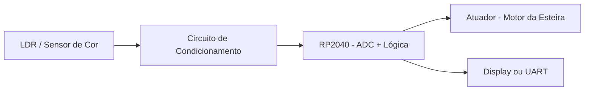

# CoresLDR_Esteira
Sensor de cores feito a partir de um resistor LDR, que tem como objetivo parar uma esteira de uma fabrica de brinquedos, caso seja detectado que um brinquedo de uma cor diferente entrou na linha de produção
## Diagrama de Blocos

