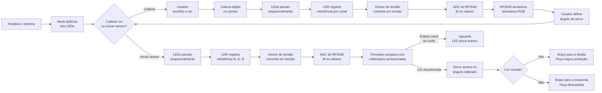
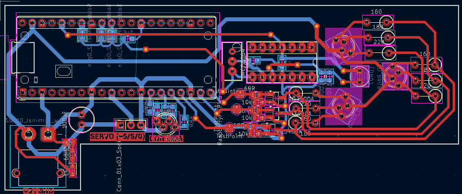
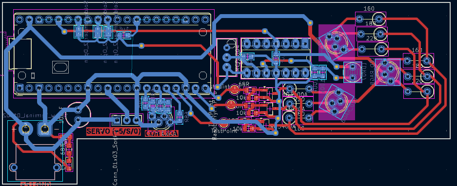
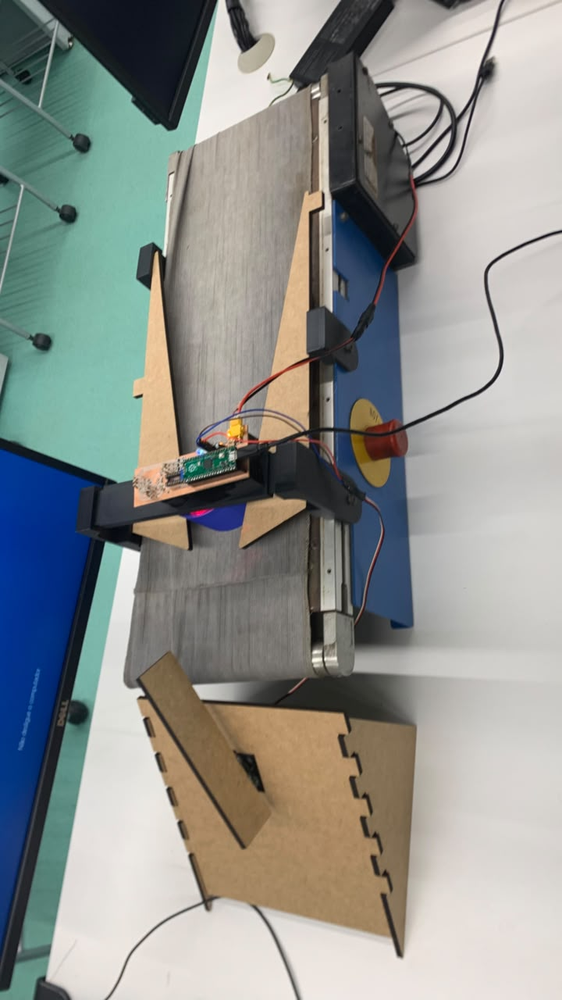

# Sensor de cores feito com um resistor LDR

## Objetivo

Desenvolver um sistema embarcado baseado no microcontrolador RP2040 capaz de identificar a cor de brinquedos em uma esteira de produção por meio de um sensor LDR, acionando um servomotor acoplado a um braço deflector para direcionar ou descartar automaticamente cada peça conforme sua cor, garantindo o controle de qualidade na linha de produção.

## Descrição Geral do Sistema

O sistema utiliza três LEDs (vermelho, verde e azul) que iluminam o objeto sobre a esteira sequencialmente. Para cada cor de LED acesa, um LDR mede a tensão refletida pelo objeto via ADC do RP2040 — formando uma assinatura RGB em voltagem para cada peça.

Antes de entrar em operação, o sistema passa por duas etapas de calibração via interface serial (UART/USB): primeiro, a calibração do tempo de decaimento do LDR (para garantir que o canal anterior apagou completamente antes de acender o próximo); depois, o treinamento de até 7 perfis de cor, incluindo obrigatoriamente o perfil NONE — a assinatura da esteira vazia, usada como filtro de ruído.

Durante a operação contínua, a cada leitura o firmware calcula a distância euclidiana no espaço RGB entre a leitura atual e todos os perfis treinados. Um filtro de limiar rejeita reflexos fracos da própria esteira. Se uma peça válida for identificada, o servomotor é travado no ângulo configurado para aquela cor por 2,8 segundos — tempo suficiente para a peça passar pelo braço deflector e ser direcionada ou descartada. Um LED RGB de status pisca em branco enquanto o sistema aguarda peças.

Toda a configuração e monitoramento é feita via comunicação serial (UART/USB), sem display físico.

## Diagrama de Blocos




## Hardware

### Esquema Elétrico do sensor de cor LDR


### PCB do Sensor

#### Top Layer



#### Bottom Layer




## Funcionalidades

- Leitura analógica de cor via sensor LDR
- Condicionamento de sinal (amplificação/filtragem)
- Classificação da cor identificada via firmware no RP2040
- Acionamento automático do motor da esteira/atuador

## Projeto Finalizado

## Estrutura do Repositório

```
CoresLDR_Esteira/
├── README.md
├── LICENSE    
├── Codigo/          # Código-fonte em C (SDK RP2040)
├── docs/                # Relatório técnico e apresentação
├── GerbersPCB/           # Arquivos relacionados a fabricação da PCB
├── images/              # Fotos do projeto e PCB
└── Solid_Parts/         # Arquivos da estrutura mecânica (SLDPRT) 

```

## Documentação

- 📄 **Relatório técnico:** [docs/relatorio-tecnico.pdf](docs/relatorio-tecnico.pdf)
- 🎤 **Apresentação:** [docs/apresentacao.pptx](docs/apresentacao.pptx)


## Integrantes

| Nome | RA |
|------|-----|
| Tiago Tosto Pereira Regente | 23.00815-6 |
| Felipe Cerquiaro da Silva Trancho | 22.01106-4 |
| Pedro Frehse Baltar | 23.95013-7 |
| Rafael Panicali Mello Guida | 21.00423-4 |

## Disciplina

Projeto Integrado das Disciplinas Instrumentação e Microcontroladores e Sistemas Microcontrolados — Instituto Mauá de Tecnologia
Prof. Andressa Martins e Prof. Rodrigo França
